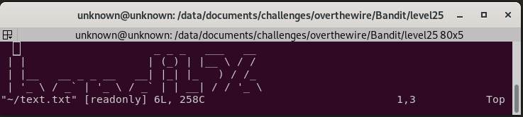

# Level 26
## Connection
~~~
ssh bandit26@bandit.labs.overthewire.org -p2220
password: 5czgV9L3Xx8JPOyRbXh6lQbmIOWvPT6Z
~~~

## Goal
Good job getting a shell! Now hurry and grab the password for bandit27!

Commands you may need to solve this level: `ls`

## Solution
### Get a shell
To solve this level, we first need a shell. As explained in the [previous level](https://github.com/sebastiendamaye/overthewire/tree/master/Bandit/level25), the SSH connection automatically terminates, because of the bad shell (`/usr/bin/showtext`) defined in `/etc/passwd`. To bypass this, we'll use the same technique as previously, based on the size window to force `more` to wait, and enter into the visual mode with the `v` key to start `vi`.

Now that we are in `vi`, we can start a shell with the following key combination: `:set shell=/bin/bash` and `:sh`

### Now with a shell
Now that we have a shell, we can resize our window. Let's see what files we have in our `home` directory:

~~~
bandit26@bandit:~$ ls -la
total 36
drwxr-xr-x  3 root     root     4096 Oct 16  2018 .
drwxr-xr-x 41 root     root     4096 Oct 16  2018 ..
-rwsr-x---  1 bandit27 bandit26 7296 Oct 16  2018 bandit27-do
-rw-r--r--  1 root     root      220 May 15  2017 .bash_logout
-rw-r--r--  1 root     root     3526 May 15  2017 .bashrc
-rw-r--r--  1 root     root      675 May 15  2017 .profile
drwxr-xr-x  2 root     root     4096 Oct 16  2018 .ssh
-rw-r-----  1 bandit26 bandit26  258 Oct 16  2018 text.txt
~~~

It looks like we have to deal with the same executable than the one in [level 19](https://github.com/sebastiendamaye/overthewire/tree/master/Bandit/level19):
~~~
bandit26@bandit:~$ ./bandit27-do 
Run a command as another user.
  Example: ./bandit27-do id
bandit26@bandit:~$ ./bandit27-do cat /etc/bandit_pass/bandit27
3ba3118a22e93127a4ed485be72ef5ea
~~~

# Flag
~~~
level27:3ba3118a22e93127a4ed485be72ef5ea
~~~