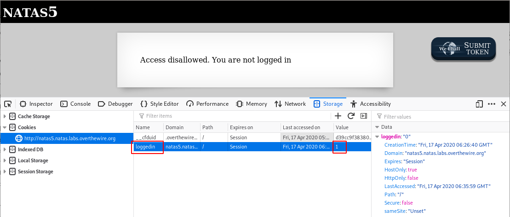
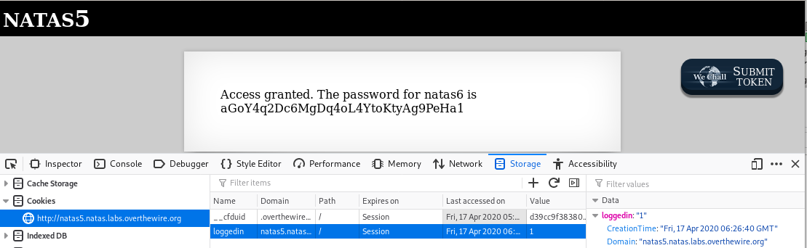

# Level 5
~~~~
$ curl --user natas5:iX6IOfmpN7AYOQGPwtn3fXpbaJVJcHfq http://natas5.natas.labs.overthewire.org
<html>
<head>
<!-- This stuff in the header has nothing to do with the level -->
<link rel="stylesheet" type="text/css" href="http://natas.labs.overthewire.org/css/level.css">
<link rel="stylesheet" href="http://natas.labs.overthewire.org/css/jquery-ui.css" />
<link rel="stylesheet" href="http://natas.labs.overthewire.org/css/wechall.css" />

</head>
<body>
<h1>natas5</h1>

Access disallowed. You are not logged in

</body>
</html>
~~~~

It says that we are not logged in. As most of the authentication require cookies, let's fire up the developper bar to list the cookies.

There is a cookie named `loggedin` set to `0`. Let's update the value to `1` and refresh the page:

# Flag
~~~~
natas6:aGoY4q2Dc6MgDq4oL4YtoKtyAg9PeHa1
~~~~
