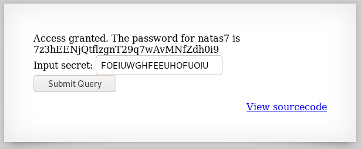

# Level 6
~~~~
$ curl --user natas6:aGoY4q2Dc6MgDq4oL4YtoKtyAg9PeHa1 http://natas6.natas.labs.overthewire.org
<html>
<head>
<!-- This stuff in the header has nothing to do with the level -->
<link rel="stylesheet" type="text/css" href="http://natas.labs.overthewire.org/css/level.css">
<link rel="stylesheet" href="http://natas.labs.overthewire.org/css/jquery-ui.css" />
<link rel="stylesheet" href="http://natas.labs.overthewire.org/css/wechall.css" />

</head>
<body>
<h1>natas6</h1>

<form method=post>
Input secret: <input name=secret> 
<input type=submit name=submit>
</form>

<a href="index-source.html">View sourcecode</a>

</body>
</html>
~~~~

We have access to the source code:
~~~~
$ curl --user natas6:aGoY4q2Dc6MgDq4oL4YtoKtyAg9PeHa1 http://natas6.natas.labs.overthewire.org/index-source.html
<code>
&lt;html&gt; &lt;head&gt; &lt;!--&nbsp;This&nbsp;stuff&nbsp;in&nbsp;the&nbsp;header&nbsp;has&nbsp;nothing&nbsp;to&nbsp;do&nbsp;with&nbsp;the&nbsp;level&nbsp;--&gt; &lt;link&nbsp;rel="stylesheet"&nbsp;type="text/css"&nbsp;href="http://natas.labs.overthewire.org/css/level.css"&gt; &lt;link&nbsp;rel="stylesheet"&nbsp;href="http://natas.labs.overthewire.org/css/jquery-ui.css"&nbsp;/&gt; &lt;link&nbsp;rel="stylesheet"&nbsp;href="http://natas.labs.overthewire.org/css/wechall.css"&nbsp;/&gt; &lt;script&nbsp;src="http://natas.labs.overthewire.org/js/jquery-1.9.1.js"&gt;&lt;/script&gt; &lt;script&nbsp;src="http://natas.labs.overthewire.org/js/jquery-ui.js"&gt;&lt;/script&gt; &lt;script&nbsp;src=http://natas.labs.overthewire.org/js/wechall-data.js&gt;&lt;/script&gt;&lt;script&nbsp;src="http://natas.labs.overthewire.org/js/wechall.js"&gt;&lt;/script&gt; &lt;script&gt;var&nbsp;wechallinfo&nbsp;=&nbsp;{&nbsp;"level":&nbsp;"natas6",&nbsp;"pass":&nbsp;"&lt;censored&gt;"&nbsp;};&lt;/script&gt;&lt;/head&gt; &lt;body&gt; &lt;h1&gt;natas6&lt;/h1&gt; &lt;div&nbsp;id="content"&gt;  &lt;?  include&nbsp;"includes/secret.inc";  &nbsp;&nbsp;&nbsp;&nbsp;if(array_key_exists("submit",&nbsp;$_POST))&nbsp;{ &nbsp;&nbsp;&nbsp;&nbsp;&nbsp;&nbsp;&nbsp;&nbsp;if($secret&nbsp;==&nbsp;$_POST['secret'])&nbsp;{ &nbsp;&nbsp;&nbsp;&nbsp;&nbsp;&nbsp;&nbsp;&nbsp;print&nbsp;"Access&nbsp;granted.&nbsp;The&nbsp;password&nbsp;for&nbsp;natas7&nbsp;is&nbsp;&lt;censored&gt;"; &nbsp;&nbsp;&nbsp;&nbsp;}&nbsp;else&nbsp;{ &nbsp;&nbsp;&nbsp;&nbsp;&nbsp;&nbsp;&nbsp;&nbsp;print&nbsp;"Wrong&nbsp;secret"; &nbsp;&nbsp;&nbsp;&nbsp;} &nbsp;&nbsp;&nbsp;&nbsp;} ?&gt;  &lt;form&nbsp;method=post&gt; Input&nbsp;secret:&nbsp;&lt;input&nbsp;name=secret&gt;&lt;br&gt; &lt;input&nbsp;type=submit&nbsp;name=submit&gt; &lt;/form&gt;  &lt;div&nbsp;id="viewsource"&gt;&lt;a&nbsp;href="index-source.html"&gt;View&nbsp;sourcecode&lt;/a&gt;&lt;/div&gt; &lt;/div&gt; &lt;/body&gt; &lt;/html&gt; 
</code>
~~~~

OK, there is a file included named `secret.inc`:
~~~~
$ curl --user natas6:aGoY4q2Dc6MgDq4oL4YtoKtyAg9PeHa1 http://natas6.natas.labs.overthewire.org/includes/secret.inc
<?
$secret = "FOEIUWGHFEEUHOFUOIU";
?>
~~~~

Back to the form, let's enter the secret:

# Flag
~~~~
natas7:7z3hEENjQtflzgnT29q7wAvMNfZdh0i9
~~~~
