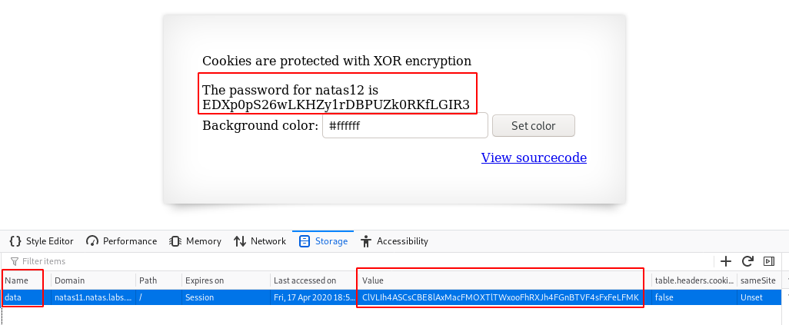

# Level 11
## What does the page look like?
```html
$ curl --user natas11:U82q5TCMMQ9xuFoI3dYX61s7OZD9JKoK http://natas11.natas.labs.overthewire.org/
<html>
<head>
<!-- This stuff in the header has nothing to do with the level -->
<link rel="stylesheet" type="text/css" href="http://natas.labs.overthewire.org/css/level.css">
<link rel="stylesheet" href="http://natas.labs.overthewire.org/css/jquery-ui.css" />
<link rel="stylesheet" href="http://natas.labs.overthewire.org/css/wechall.css" />
<script src="http://natas.labs.overthewire.org/js/jquery-1.9.1.js"></script>
<script src="http://natas.labs.overthewire.org/js/jquery-ui.js"></script>
<script src=http://natas.labs.overthewire.org/js/wechall-data.js></script><script src="http://natas.labs.overthewire.org/js/wechall.js"></script>
<script>var wechallinfo = { "level": "natas11", "pass": "U82q5TCMMQ9xuFoI3dYX61s7OZD9JKoK" };</script></head>

<h1>natas11</h1>
<div id="content">
<body style="background: #ffffff;">
Cookies are protected with XOR encryption<br/><br/>


<form>
Background color: <input name=bgcolor value="#ffffff">
<input type=submit value="Set color">
</form>

<div id="viewsource"><a href="index-source.html">View sourcecode</a></div>
</div>
</body>
</html>
```

## Source code
We are provided with the source code:
```html
$ curl -s --user natas11:U82q5TCMMQ9xuFoI3dYX61s7OZD9JKoK http://natas11.natas.labs.overthewire.org/index-source.html | html2text 
<html>
<head>
<!-- This stuff in the header has nothing to do with the level -->
<link rel="stylesheet" type="text/css" href="http://natas.labs.overthewire.org/
css/level.css">
<link rel="stylesheet" href="http://natas.labs.overthewire.org/css/jquery-
ui.css" />
<link rel="stylesheet" href="http://natas.labs.overthewire.org/css/
wechall.css" />
<script src="http://natas.labs.overthewire.org/js/jquery-1.9.1.js"></script>
<script src="http://natas.labs.overthewire.org/js/jquery-ui.js"></script>
<script src=http://natas.labs.overthewire.org/js/wechall-data.js></
script><script src="http://natas.labs.overthewire.org/js/wechall.js"></script>
<script>var wechallinfo = { "level": "natas11", "pass": "<censored>" };</
script></head>
<?

$defaultdata = array( "showpassword"=>"no", "bgcolor"=>"#ffffff");

function xor_encrypt($in) {
    $key = '<censored>';
    $text = $in;
    $outText = '';

    // Iterate through each character
    for($i=0;$i<strlen($text);$i++) {
    $outText .= $text[$i] ^ $key[$i % strlen($key)];
    }

    return $outText;
}

function loadData($def) {
    global $_COOKIE;
    $mydata = $def;
    if(array_key_exists("data", $_COOKIE)) {
    $tempdata = json_decode(xor_encrypt(base64_decode($_COOKIE
["data"])), true);
    if(is_array($tempdata) && array_key_exists
("showpassword", $tempdata) && array_key_exists("bgcolor", $tempdata)) {
        if (preg_match('/^#(?:[a-f\d]{6})$/i', $tempdata['bgcolor'])) {
        $mydata['showpassword'] = $tempdata['showpassword'];
        $mydata['bgcolor'] = $tempdata['bgcolor'];
        }
    }
    }
    return $mydata;
}

function saveData($d) {
    setcookie("data", base64_encode(xor_encrypt(json_encode($d))));
}

$data = loadData($defaultdata);

if(array_key_exists("bgcolor",$_REQUEST)) {
    if (preg_match('/^#(?:[a-f\d]{6})$/i', $_REQUEST['bgcolor'])) {
        $data['bgcolor'] = $_REQUEST['bgcolor'];
    }
}

saveData($data);


?>

<h1>natas11</h1>
<div id="content">
<body style="background: <?=$data['bgcolor']?>;">
Cookies are protected with XOR encryption<br/><br/>

<?
if($data["showpassword"] == "yes") {
    print "The password for natas12 is <censored><br>";
}

?>

<form>
Background color: <input name=bgcolor value="<?=$data['bgcolor']?>">
<input type=submit value="Set color">
</form>

<div id="viewsource"><a href="index-source.html">View sourcecode</a></div>
</div>
</body>
</html>
```

## Reversing the code
An encrypted cookie named `data` is defined to keep track of 2 session values:
* `showpassword`: set to `no` by default
* `bgcolor` set to `#ffffff` by default

This cookie is encrypted as follows:
~~~~
base64_encode(xor_encrypt(json_encode($d)))
~~~~

Now, if you fire up the developer bar, you will notice that a session cookie is defined. Mine had the following value: `ClVLIh4ASCsCBE8lAxMacFMZV2hdVVotEhhUJQNVAmhSEV4sFxFeaAw%3D`

Let's decrypt its value in python:
```python
from pwn import *
message_b64 = 'ClVLIh4ASCsCBE8lAxMacFMZV2hdVVotEhhUJQNVAmhSEV4sFxFeaAw='
message = b64d(message_b64)
key = '{"showpassword":"no","bgcolor":"#ffffff"}'
print(xor(message, key))
```
Here is the output: `qw8Jqw8Jqw8Jqw8Jqw8Jqw8Jqw8Jqw8Jqw8Jqw8Jq`. We conclude that the XOR key is `qw8J`.

Now that we know the key, let's craft a new session cookie based on the following values:
* `showpassword` = `yes` (this is what we want to have the password revealed)
* `bgcolor` = `#ffffff` (we leave the default value)

```python
from pwn import *
message = '{"showpassword":"yes","bgcolor":"#ffffff"}'
key = 'qw8J'
print(b64e(xor(message, key)))
```
Output: `ClVLIh4ASCsCBE8lAxMacFMOXTlTWxooFhRXJh4FGnBTVF4sFxFeLFMK`

## Set the new cookie
Now, back to the developer bar, update the value of the cookie to be `ClVLIh4ASCsCBE8lAxMacFMOXTlTWxooFhRXJh4FGnBTVF4sFxFeLFMK` and refresh the page. The password will be revealed:



# Flag
~~~~
natas12:EDXp0pS26wLKHZy1rDBPUZk0RKfLGIR3
~~~~
